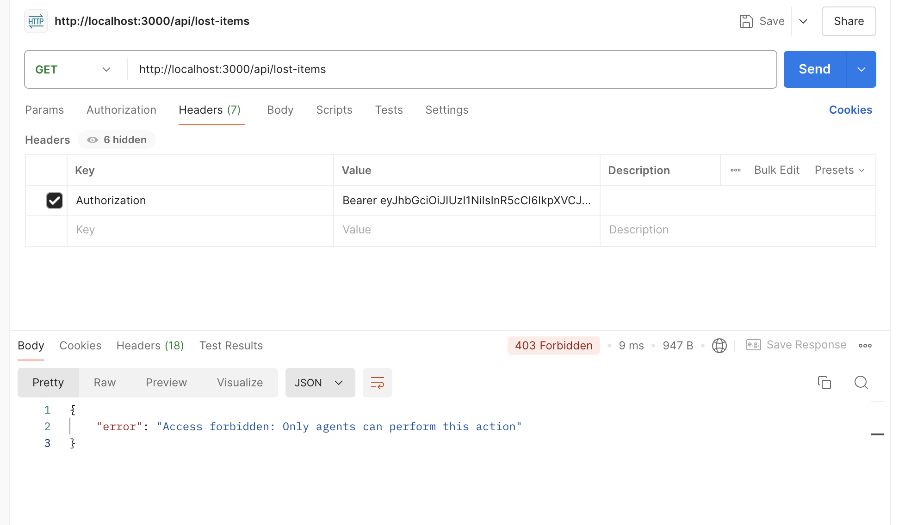
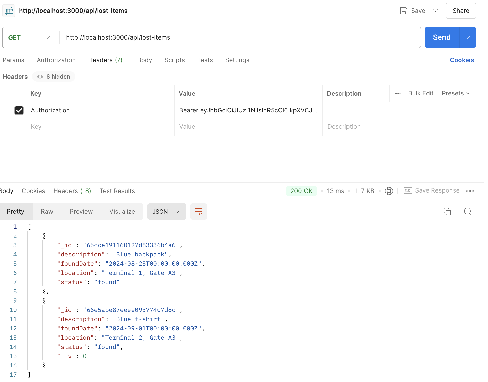
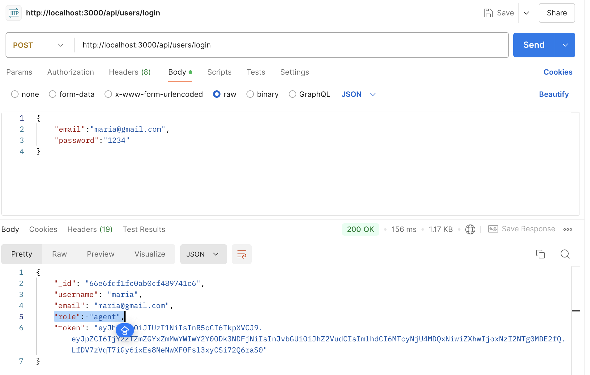

# Lost-and-found

## Introduction 

The Lost and Found project is a system designed to manage lost and found items within an airport. 
The system allows two distinct types of users: agents and passengers. 
Agents have the ability to list, create, and delete lost items,  while a passenger is able to report his loss (e.g. by describing the product).


## Features

### Agent Functionalities:

- List Lost Items: Agents can view all lost items in the system.
- Create Lost Items: Agents can report new lost items by providing necessary details.
- Delete Lost Items: Agents can remove items from the system that are no longer relevant.

### Passenger Functionalities:

- Search Lost Items: Passengers can search for lost items using keywords such as description, brand, color, and lost time.

## Authentication and Authorization

- Authentication: Users (both agents and passengers) are authenticated using JSON Web Tokens (JWT). 
- Upon registration or login, users receive a token that must be included in the Authorization header for secured endpoints.
- Authorization: Agents are authorized to perform actions like listing, creating, and deleting lost items. 
- Passengers are authorized only to search for lost items.

## How It Works

### Registration and Login:
- Users (agents and passengers) can register and log in to the system. 
- Upon successful login, a JWT is issued which includes the user's role (agent or passenger).

### Middleware:

- Authentication middleware checks the validity of the JWT and retrieves the user information.
- Authorization middleware ensures that users have the appropriate role to perform the requested action.

### Endpoints:

- POST /api/users/register : 
- POST /api/users/login:
- GET /api/lost-items : Lists all lost items (for agents).
- GET /api/lost-items/:id : Look for a specific item by id.
- POST /api/lost-items : Creates a new lost item (for agents).
- DELETE /api/lost-items/ : Deletes a lost item (for agents).

## Use cases

- US1: as an agent, I want to list all lost items
- US2: as an agent, I want to create a lost item
- US3: as an agent, I want to find a particular item
- US4: as a passanger, I want to look for my item
- US5: as a agent, I want to delete a particular item


### Getting Started

To get started with this project, follow these steps:

To set up the project locally, you will need:

- Node.js: Server-side JavaScript runtime.
- Express.js: Web framework for Node.js.
- MongoDB: NoSQL database for storing lost item data.
- JWT: JSON Web Tokens for secure authentication and authorization.
- Mongoose: ODM library for MongoDB and Node.js.
- Postman.


1. Install Node.js locally with Homebrew:
```
brew install node
```

2. If you haven't installed MongoDB yet, you'll need to install it on your system.
- You can download it from the official MongoDB website: [MongoDB Download Center](https://www.mongodb.com/try/download/community)
- If you installed MongoDB using Homebrew, run the following command:
```
brew services start mongodb-community
```
- Without starting the MongoDB service, your application wouldn’t be able to connect to the database since MongoDB wouldn't be running.

3. Install postman locally : go to the official [Postman website](https://www.postman.com/downloads/)


4. Clone the repository:
```
https://github.com/maria-parreira/lost-and-found.git
```

5. On the root of this repo, run the following command to install dependencies:
```
npm install
```

6. On the root of this repo, run the following command to run the application:
```
npm start
```

## Some of my Results

You can see Documentation in Postman  [here](https://documenter.getpostman.com/view/34771271/2sAXqqcNSc)






